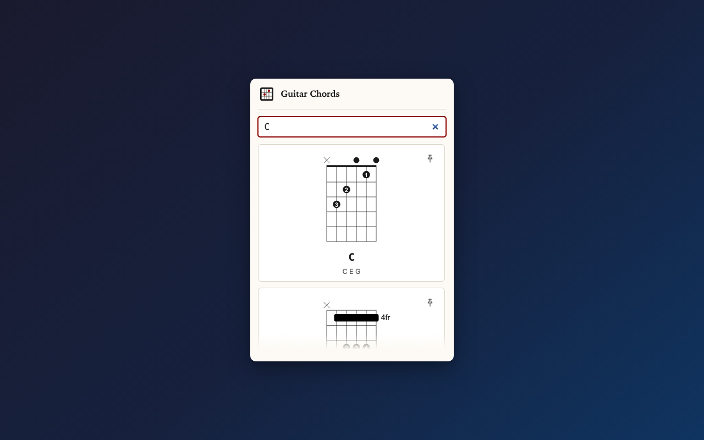
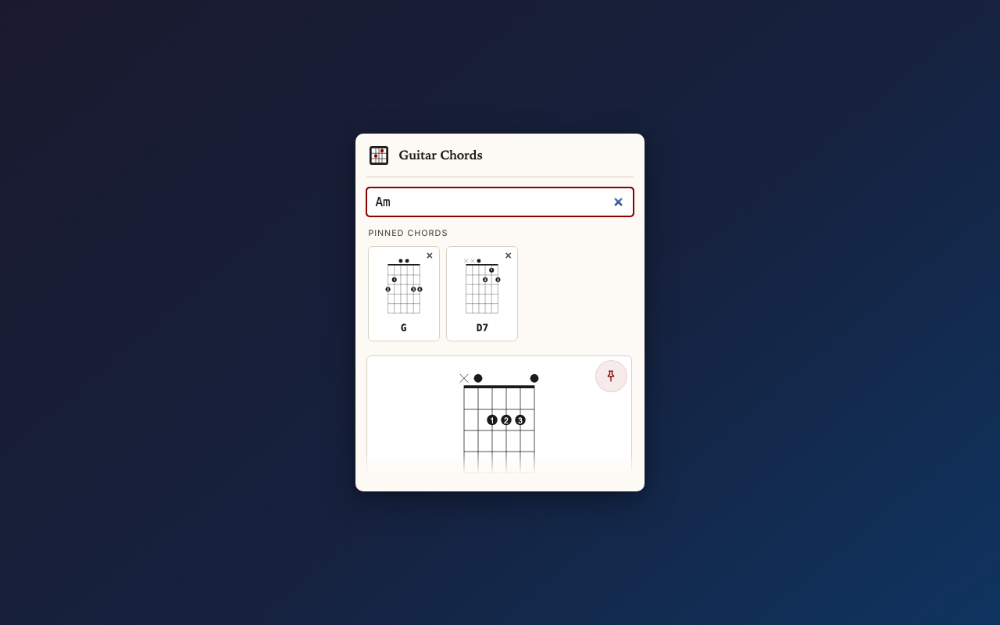

# Guitar Chords

Instant guitar chord diagrams for any chord name — Cmaj7, Am7, D/F♯ and more.

**Live site →** https://acordesdeguitarra.com.ar/

Available in English and Spanish. Open-position diagrams for 100+ chords.
Built with vanilla JS, no framework, no build step beyond a Node.js assembly script.

| Search | Pinned chords |
|:---:|:---:|
|  |  |

---

## Project structure

```
src/
  shared/          # Chord DB, diagram renderer, search — used by both site and extension
  site/            # Web app: template.html, chord-finder component, site.css
  extension/       # Chrome extension: manifest, popup, icons, _locales/
  i18n/            # Strings for the site (strings.es.json, strings.en.json)
vendor/            # Bundled svguitar.umd.js
scripts/
  build-site.js    # Assembles dist/site/
  build-ext.js     # Assembles dist/extension/ and extension.zip
  vendor.js        # Downloads / updates vendor assets
test/
  chord-search.unit.js   # Unit tests (Node, no browser)
  chord-finder.e2e.js    # E2E tests (Playwright)
dist/              # Build output — not committed (except extension.zip for releases)
```

## Getting started

```bash
npm install
npm run vendor      # Download vendored assets (only needed once / after updates)
npm run build       # Build site + extension → dist/
npm test            # Unit + E2E tests
```

Individual build targets:

```bash
npm run build:site  # → dist/site/
npm run build:ext   # → dist/extension/ + dist/extension.zip
```

### Environment variables

| Variable | Default | Purpose |
|---|---|---|
| `SITE_BASE_URL` | `https://acordesdeguitarra.com.ar` | Canonical URLs, og:url, sitemap |
| `EXTENSION_STORE_URL` | *(empty)* | Enables "Add to Chrome" button on the site when set |

### OG / social image

Place your screenshot at `src/site/og-image.png` before building.
The build script copies it to `dist/site/assets/og-image.png` automatically.
Recommended size: **1200 × 630 px**.

---

## Deploying the site (GitHub Pages)

The site is deployed from the `dist/site/` directory to GitHub Pages.

```bash
npm run build:site
# then push dist/site/ to gh-pages branch, or use the CI workflow
```

GitHub Actions CI (`.github/workflows/ci.yml`) runs tests on every push.

---

## Chrome extension

### Load unpacked (development)

1. `npm run build:ext`
2. Open `chrome://extensions` → **Load unpacked** → select `dist/extension/`

### Publish to Chrome Web Store

See [`store/PUBLISHING.md`](store/PUBLISHING.md) for the full checklist and store listing copy.

Quick steps:
1. `npm run build:ext` — produces `dist/extension.zip`
2. Go to the [Chrome Web Store Developer Dashboard](https://chrome.google.com/webstore/devconsole)
3. Upload `dist/extension.zip`
4. Fill in the store listing using the copy in `store/listing.md`
5. Upload screenshots from `store/screenshots/` (1280×800 or 640×400)
6. Set the privacy policy URL (host `store/privacy-policy.html` somewhere public, e.g. GitHub Pages)
7. Submit for review

---

## Roadmap

See [ROADMAP.md](ROADMAP.md).
